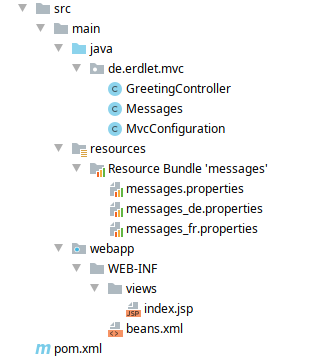

## Internationalization with the MVC API 1.0
Almost every important application has to support several languages sooner or later. How to achieve this goal with the MVC API 1.0 is described below with an example.

### Fundamentals of Internationalization in the API
In MVC 1.0, the `MvcContext` can be used to retrieve the `Locale` for each request via `MvcContext#getLocale()`. The `Locale`
is taken from the HTTP header `Accept-Language` by the default `LocaleResolver` of the used implementation.
If the header is missing, the system default `Locale` is used.

### Preconditions
- Application server
- Java EE 8
- MVC API 1.0
- Eclipse Krazo (for the used application server)
- Maven

### Project layout
A simple web application is used for the example. The project layout for this is as follows:



In addition, these are the required Maven dependencies:

```xml
<repositories>
    <repository>
        <id>sonatype-oss-snapshots</id>
        <url>https://oss.sonatype.org/content/repositories/snapshots</url>
        <releases>
            <enabled>false</enabled>
        </releases>
        <snapshots>
            <enabled>true</enabled>
        </snapshots>
    </repository>
</repositories>

<dependencies>

    <dependency>
      <groupId>javax.mvc</groupId>
      <artifactId>javax.mvc-api</artifactId>
      <version>1.0-pfd</version>
    </dependency>

    <!-- Change if your application server doesn't use Jersey -->
    <dependency>
      <groupId>org.eclipse.krazo</groupId>
      <artifactId>krazo-jersey</artifactId>
      <version>1.0.0-SNAPSHOT</version>
    </dependency>

    <dependency>
      <groupId>javax</groupId>
      <artifactId>javaee-api</artifactId>
      <version>8.0</version>
      <scope>provided</scope>
    </dependency>
  </dependencies>
```

**Attention**: The project was implemented on Payara 5 and therefore uses the jersey implementation
from Eclipse Krazo. For Wildfly or OpenLiberty / TomEE please use the appropriate artifacts.

The translations used later in the application are stored in the respective `messages.properties`:


**messages.properties**
```
greeting=Hello!
farewell=Good bye!
```

**messages_de.properties**
```
greeting=Hallo!
```

**messages_fr.properties**
```
greeting=Bonjour!
```

### Implementing the internationalization
#### MvcConfigurtion and GreetingController
The application uses an "empty" JAX-RS application and a controller whose only method returns the `index.jsp` template. This works similar to the *Hello World* example and is therefore not explained in detail.

#### The Messages class
The starting point of this approach to the internationalization of MVC applications is the class `Messages`. This provides a single
method `get(String)`, which determines the correct translation based on the key of a key-value pair set in the `messages_XYZ.properties`. 

```java
/**
 * Provides I18n messages for the UI per request. To get the correct locale, the method {@link MvcContext#getLocale()} is used.
 * This method uses the built-in {@link javax.mvc.locale.LocaleResolver} of the used MVC Implementation.
 *
 * @author Tobias Erdle
 * @see MvcContext#getLocale()
 * @see javax.mvc.locale.LocaleResolver
 */
@RequestScoped
@Named("msg")
public class Messages {

  private static final String BASE_NAME = "messages";

  @Inject
  private MvcContext mvcContext;

  /**
   * Get the assigned message to some key based on the {@link java.util.Locale} of the current request.
   *
   * @param key the message key to use
   * @return the correct translation assigned to the key for the request locale, a fallback translation or
   * a placeholder for unknown keys.
   */
  public final String get(final String key) {
    final var bundle = ResourceBundle.getBundle(BASE_NAME, mvcContext.getLocale());

    return bundle.containsKey(key) ? bundle.getString(key) : formatUnknownKey(key);
  }

  private static String formatUnknownKey(final String key) {
    return String.format("???%s???", key);
  }
}
```
Since the class is annotated with `@Named`, it can be used directly in MVC templates (if the `ViewEngine` supports CDI). Since
the `ViewEngine` for JSPs can do this, the `Messages` classes in the example template will be called as follows:

```html
<%@ page contentType="text/html;charset=UTF-8" language="java" %>
<html>
<head>
    <title>I18n Index</title>
</head>
<body>
<div id="known-message">
    <p>${msg.get("greeting")}</p>
</div>

<div id="fallback-message">
    <p>${msg.get("farewell")}</p>
</div>

<div id="unknown-message">
    <p>${msg.get("something-unknown")}</p>
</div>
</body>
</html>

```

With each call to `get(String)` the appropriate `ResourceBundle` for the `Locale` occurring in the request is now loaded and searched for a translation of the specified key. If the key is found, but none of the found `ResourceBundles` matches, the default `Locale`'s `messages.properties` or the general `messages.properties` is used.

If you now execute the example with different `Locale`s, you get the following HTML pages according to the `messages.properties`:

*curl -X GET http://localhost:8080/mvc-language-examples/mvc/greeting -H 'Accept-Language: en'*
```html
<%@ page contentType="text/html;charset=UTF-8" language="java" %>
<html>
<head>
    <title>I18n Index</title>
</head>
<body>
<div id="known-message">
    <p>Hello!</p>
</div>

<div id="fallback-message">
    <p>Good bye!</p>
</div>

<div id="unknown-message">
    <p>???something-unknown???</p>
</div>
</body>
</html>

```

*curl -X GET http://localhost:8080/mvc-language-examples/mvc/greeting -H 'Accept-Language: de'*
```html
<%@ page contentType="text/html;charset=UTF-8" language="java" %>
<html>
<head>
    <title>I18n Index</title>
</head>
<body>
<div id="known-message">
    <p>Hallo!</p>
</div>

<div id="fallback-message">
    <p>Good bye!</p>
</div>

<div id="unknown-message">
    <p>???something-unknown???</p>
</div>
</body>
</html>

```

*curl -X GET http://localhost:8080/mvc-language-examples/mvc/greeting -H 'Accept-Language: fr'*
```html
<%@ page contentType="text/html;charset=UTF-8" language="java" %>
<html>
<head>
    <title>I18n Index</title>
</head>
<body>
<div id="known-message">
    <p>Bonjour!</p>
</div>

<div id="fallback-message">
    <p>Good bye!</p>
</div>

<div id="unknown-message">
    <p>???something-unknown???</p>
</div>
</body>
</html>

```

### Further sources
- [MVC Specification](https://oss.sonatype.org/service/local/repositories/snapshots/content/javax/mvc/javax.mvc-api/1.0-SNAPSHOT/javax.mvc-api-1.0-20190530.105420-89-spec.pdf)
- [Example project](https://github.com/erdlet/mvc-international-example/tree/master/multilang-messages)